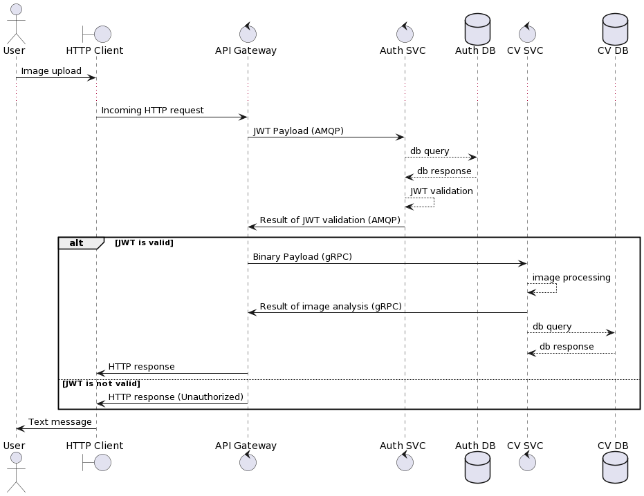

# Сценарії взаємодії

## Схема взаємодії сервісів

<figure><figcaption>
Sequence діаграма взаємодії сервісів в системі
</figcaption></figure>

* **User** - Кінцевий користувач системи.
* **HTTP Client** - Клієнт, який робить HTTP запити (це може бути як частина іншого сервісу, так і окремий користувач).
* **API Gateway** - Централізований сервіс, який функціонує як посередник між зовнішніми клієнтами та внутрішніми бекенд-сервісами. Він надає інтерфейс у вигляді REST API для взаємодії із системою. Окрім цього, API Gateway відповідає за обробку та маршрутизацію запитів до відповідних бекенд-сервісів.
* **Auth Service** - Відповідає за процес верифікації ідентичності користувачів та надання їм доступу до ресурсів або послуг. Він займається реєстрацією нових користувачів, генерацією JWT токенів та їх подальшою валідацією.
* **Auth DB** - База даних, яка зберігає облікові записи користувачів та пов'язану з ними інформацію.
* **Computer Vision Service** - Аналізує отримане зображення та генерує відповідний йому опис.
* **Computer Vision DB** - База даних, яка зберігає результати аналізу зображень.
