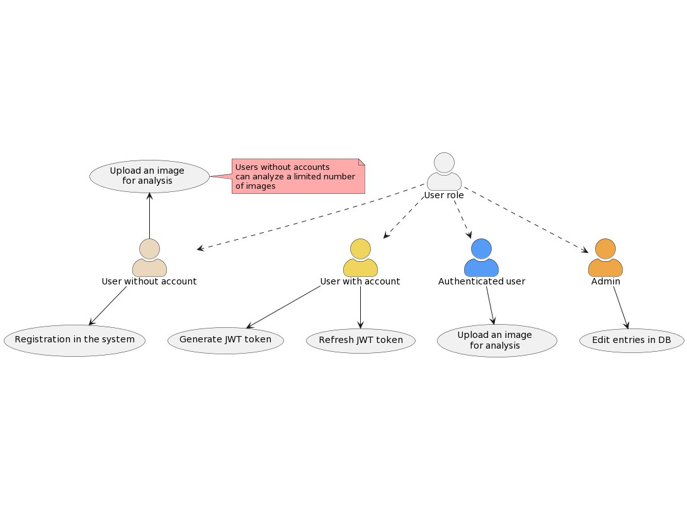
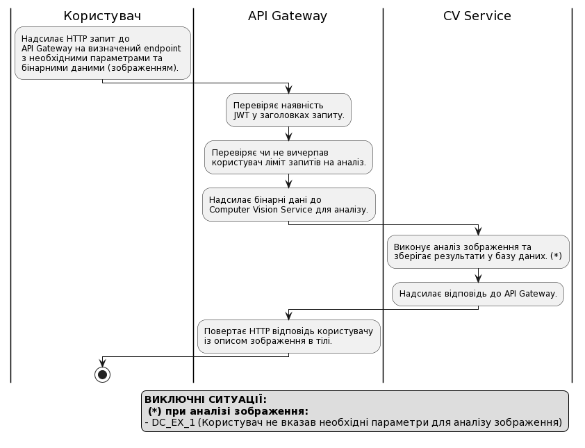
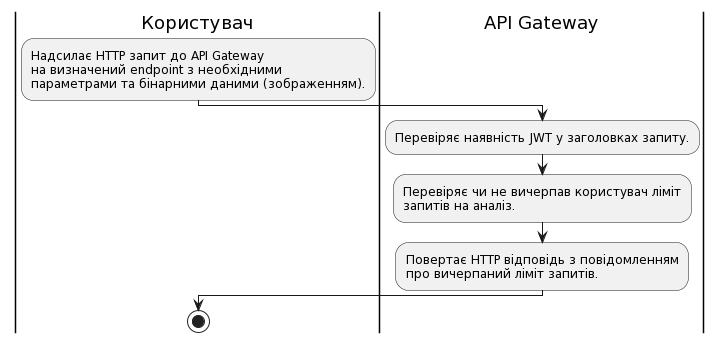
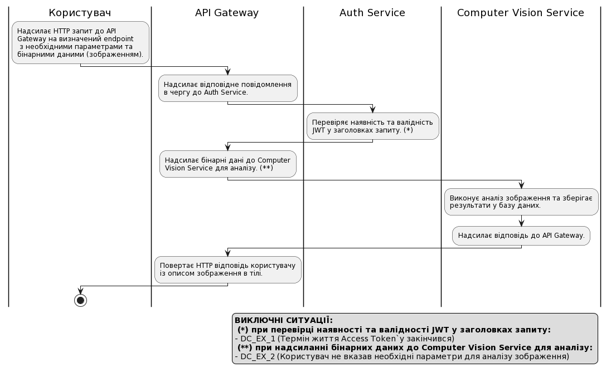

# Сценарії взаємодії

## Схема взаємодії сервісів

<figure><figcaption>
Sequence діаграма взаємодії сервісів в системі
</figcaption></figure>

* **User** - Кінцевий користувач системи.
* **HTTP Client** - Клієнт, який робить HTTP запити (це може бути як частина іншого сервісу, так і окремий користувач).
* **API Gateway** - Централізований сервіс, який функціонує як посередник між зовнішніми клієнтами та внутрішніми бекенд-сервісами. Він надає інтерфейс у вигляді REST API для взаємодії із системою. Окрім цього, API Gateway відповідає за обробку та маршрутизацію запитів до відповідних бекенд-сервісів.
* **Auth Service** - Відповідає за процес верифікації ідентичності користувачів та надання їм доступу до ресурсів або послуг. Він займається реєстрацією нових користувачів, генерацією JWT токенів та їх подальшою валідацією.
* **Auth DB** - База даних, яка зберігає облікові записи користувачів та пов'язану з ними інформацію.
* **Computer Vision Service** - Аналізує отримане зображення та генерує відповідний йому опис.
* **Computer Vision DB** - База даних, яка зберігає результати аналізу зображень.

## Модель прецедентів 

<figure><figcaption>
Модель прецедентів
</figcaption></figure>

## Сценарії використання

### Користувач без облікового запису

<table><thead><tr><th width="255">ID</th><th>DC_1.1</th></tr></thead><tbody><tr><td><strong>НАЗВА</strong></td><td>Реєстрація користувача</td></tr><tr><td><strong>УЧАСНИКИ</strong></td><td>Користувач, API Gateway, Auth Service</td></tr><tr><td><strong>ПЕРЕДУМОВИ</strong></td><td>Користувач не має облікового запису в системі</td></tr><tr><td><strong>РЕЗУЛЬТАТ</strong></td><td>Створений обліковий запис користувача</td></tr></tbody></table>

<figure><figcaption>
DC_1.1
</figcaption></figure>

<table><thead><tr><th width="255">ID</th><th>DC_1.2</th></tr></thead><tbody><tr><td><strong>НАЗВА</strong></td><td>Аналіз зображення</td></tr><tr><td><strong>УЧАСНИКИ</strong></td><td>Користувач, API Gateway, CV Service</td></tr><tr><td><strong>ПЕРЕДУМОВИ</strong></td><td>Користувач не вказав JWT у заголовках HTTP запиту Користувач використав меньше трьох спроб для аналізу</td></tr><tr><td><strong>РЕЗУЛЬТАТ</strong></td><td>Користувач отримує опис зображення</td></tr></tbody></table>

<figure><figcaption>
DC_1.2
</figcaption></figure>

<table><thead><tr><th width="255">ID</th><th>DC_1.3</th></tr></thead><tbody><tr><td><strong>НАЗВА</strong></td><td>Вичерпання ліміту запитів</td></tr><tr><td><strong>УЧАСНИКИ</strong></td><td>Користувач, API Gateway</td></tr><tr><td><strong>ПЕРЕДУМОВИ</strong></td><td>Користувач не вказав JWT у заголовках HTTP запиту Користувач використав три спроби для аналізу</td></tr><tr><td><strong>РЕЗУЛЬТАТ</strong></td><td>Користувач отримує повідомлення про вичерпаний ліміт запитів</td></tr></tbody></table>

<figure><figcaption>
DC_1.3
</figcaption></figure>

### Користувач із існуючим обліковим записом

<table><thead><tr><th width="255">ID</th><th>DC_2.1</th></tr></thead><tbody><tr><td><strong>НАЗВА</strong></td><td>Генерація JWT</td></tr><tr><td><strong>УЧАСНИКИ</strong></td><td>Користувач, API Gateway, Auth Service</td></tr><tr><td><strong>ПЕРЕДУМОВИ</strong></td><td>Користувач має підтверджений обліковий запис в системі</td></tr><tr><td><strong>РЕЗУЛЬТАТ</strong></td><td>Користувач отримує сгенерований JWT</td></tr></tbody></table>

<figure><figcaption>
DC_2.1
</figcaption></figure>

<table><thead><tr><th width="255">ID</th><th>DC_2.2</th></tr></thead><tbody><tr><td><strong>НАЗВА</strong></td><td>Оновлення JWT</td></tr><tr><td><strong>УЧАСНИКИ</strong></td><td>Користувач, API Gateway, Auth Service</td></tr><tr><td><strong>ПЕРЕДУМОВИ</strong></td><td>Користувач має дійсний Refresh Token</td></tr><tr><td><strong>РЕЗУЛЬТАТ</strong></td><td>Користувач отримує новий JWT</td></tr></tbody></table>

<figure><figcaption>
DC_2.2
</figcaption></figure>

### Аутентифікований користувач

<table><thead><tr><th width="255">ID</th><th>DC_3.1</th></tr></thead><tbody><tr><td><strong>НАЗВА</strong></td><td>Аналіз зображення</td></tr><tr><td><strong>УЧАСНИКИ</strong></td><td>Користувач, API Gateway, Auth Service, CV Service</td></tr><tr><td><strong>ПЕРЕДУМОВИ</strong></td><td>Користувач вказав дійсний JWT у заголовках HTTP запиту</td></tr><tr><td><strong>РЕЗУЛЬТАТ</strong></td><td>Користувач отримує опис зображення</td></tr></tbody></table>

<figure><figcaption></figcaption></figure>

### Адміністратор

<table><thead><tr><th width="255">ID</th><th>DC_4.1</th></tr></thead><tbody><tr><td><strong>НАЗВА</strong></td><td>Редагування запису у БД</td></tr><tr><td><strong>УЧАСНИКИ</strong></td><td>Адміністратор, СУБД</td></tr><tr><td><strong>ПЕРЕДУМОВИ</strong></td><td>Користувач має роль адміністратора в СУБД</td></tr><tr><td><strong>РЕЗУЛЬТАТ</strong></td><td>Оновлений запис в таблиці БД</td></tr></tbody></table>

<figure><figcaption>
DC_4.1
</figcaption></figure>
